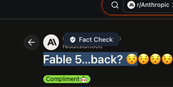
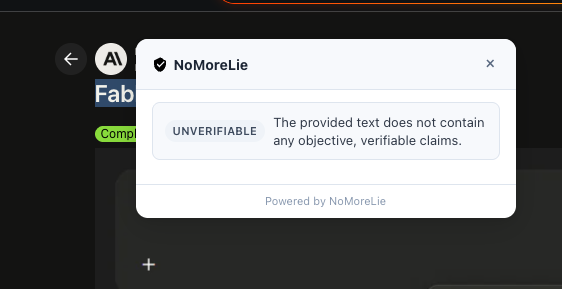
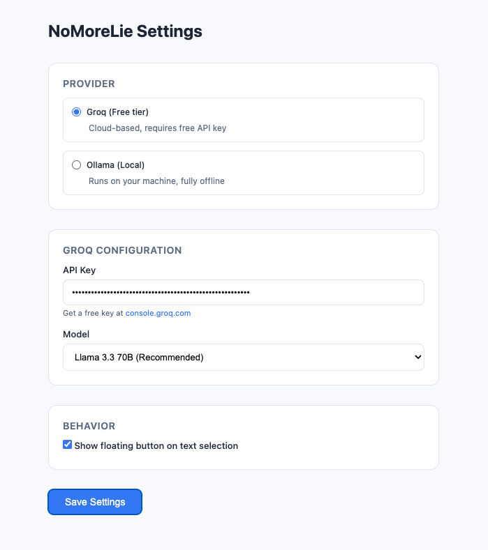

# NoMoreLie

AI-powered Chrome extension that fact-checks selected text on any webpage. Highlight a claim, click **Fact Check**, and get a structured verdict with per-claim breakdowns, confidence scores, and explanations.

## Screenshots

| Floating button | Results panel | Settings |
|-----------------|---------------|----------|
|  |  |  |

## Features

- **Instant fact-checking** — Select text on any page and verify claims in seconds
- **Floating action button** — Appears automatically when you highlight text (10+ characters)
- **Context menu** — Right-click selected text → "Fact Check with NoMoreLie"
- **Structured results** — Overall verdict, summary, and individual claim analysis
- **Dual AI providers** — Cloud (Groq) or local (Ollama)
- **Privacy-conscious** — AI calls run from the extension background worker, not the page itself

## How It Works

1. Select text on any webpage
2. Click the floating **Fact Check** button (or use the right-click context menu)
3. The extension sends the text to your configured AI provider
4. Results appear in an overlay panel with verdicts and confidence bars

### Verdicts

Each claim is rated as one of:

| Verdict | Meaning |
|---------|---------|
| **True** | The claim is accurate |
| **False** | The claim is inaccurate |
| **Partially True** | Mix of accurate and inaccurate elements |
| **Unverifiable** | Cannot be assessed (opinion, private data, real-time info, etc.) |

## Installation

### From source (developer mode)

1. Clone this repository:

   ```bash
   git clone https://github.com/ayushguptaz/NoMoreLie.git
   cd NoMoreLie
   ```

2. Open Chrome and go to `chrome://extensions`

3. Enable **Developer mode** (top-right toggle)

4. Click **Load unpacked** and select the project directory

5. Click the NoMoreLie icon → **Settings** and configure your AI provider

## Configuration

Open the extension popup and click **Settings**, or go to `chrome://extensions` → NoMoreLie → **Extension options**.

### Groq (recommended — free tier)

1. Get a free API key at [console.groq.com/keys](https://console.groq.com/keys)
2. Select **Groq** as the provider
3. Paste your API key
4. Choose a model (default: **Llama 3.3 70B**)

### Ollama (local / offline)

1. Install [Ollama](https://ollama.com)
2. Pull a model:

   ```bash
   ollama pull llama3
   ```

3. Select **Ollama** as the provider
4. Set server URL (default: `http://localhost:11434`) and model name

## Project Structure

```
NoMoreLie/
├── manifest.json       # Extension manifest (MV3)
├── background.js       # Service worker — orchestrates fact-checks
├── content.js          # Injected on all pages — selection UI + results panel
├── content.css         # Minimal styles (most UI lives in Shadow DOM)
├── popup.html/js/css   # Extension popup — status & stats
├── options.html/js/css # Settings page — provider & API config
├── icons/              # Extension icons (16, 32, 48, 128 px)
└── lib/
    ├── prompts.js      # System prompt & user prompt builder
    └── providers.js    # Groq & Ollama API clients
```

## Architecture

```
┌─────────────────────────────────────────────────────────┐
│  Webpage (content.js)                                   │
│  • Detects text selection                               │
│  • Shows floating "Fact Check" button                   │
│  • Renders results in Shadow DOM panel                  │
└──────────────────────┬──────────────────────────────────┘
                       │ chrome.runtime.sendMessage
                       ▼
┌─────────────────────────────────────────────────────────┐
│  Background Service Worker (background.js)              │
│  • Receives fact-check requests                         │
│  • Loads settings from chrome.storage.sync              │
│  • Builds prompts → calls AI provider                   │
│  • Parses JSON response → sends back to content script  │
│  • Persists stats to chrome.storage.local               │
└──────────────────────┬──────────────────────────────────┘
                       │ fetch()
                       ▼
              ┌────────┴────────┐
              │                 │
         Groq API           Ollama API
    api.groq.com      localhost:11434
```

### Message flow

| Direction | Message | Purpose |
|-----------|---------|---------|
| Content → Background | `FACT_CHECK` | Trigger fact-check with `{ text, pageUrl }` |
| Background → Content | `FACT_CHECK_LOADING` | Show spinner |
| Background → Content | `FACT_CHECK_RESULT` | Display parsed verdict |
| Background → Content | `FACT_CHECK_ERROR` | Show error message |

## Permissions

| Permission | Why |
|------------|-----|
| `contextMenus` | Right-click "Fact Check" menu item |
| `storage` | Save settings and usage stats |
| `activeTab` | Message the current tab |
| `https://api.groq.com/*` | Groq API calls |
| `http://localhost:11434/*` | Local Ollama calls |

API keys are stored in `chrome.storage.sync` and never exposed to webpage JavaScript.

> **Note:** The content script runs on all pages (`<all_urls>`) to power the floating button on text selection. Because this is a broad host permission, the Chrome Web Store may subject the extension to an in-depth review.

## Limitations

- Text is truncated to **4,000 characters** per check
- Fact-checking relies on the AI model's training knowledge — no live web search
- The AI may mark time-sensitive or niche claims as **Unverifiable**
- Results should be treated as a starting point, not definitive proof

## License

Released under the [MIT License](LICENSE). © 2026 Ayush Gupta.
